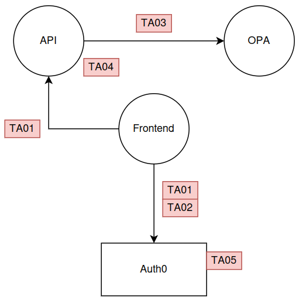
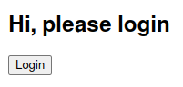

# Cybersecurity Advanced Opdracht 3: Get to know advanced IAM practices
*Door Tom Goedemé en Niels van de Ginste*

Repository: [https://github.com/flufsor/CSA3-OPA](https://github.com/flufsor/CSA3-OPA)
## Threat analysis

Hieronder kan u onze threat analysis terugvinden van onze applicatie.




## Frontend

Als frontend hebben we een eenvoudige bartab applicatie gemaakt waar de klanten hun rekening kunnen bijhouden. We hebben gebruik gemaakt van Angular om onze SPA op te bouwen.

Angular toont andere componenten op basis de loginstatus van de gebruiker. Wanneer de gebruiker nog niet is ingelogd, wordt een login knop getoond.



Deze knop verwijst naar een Auth0 login pagina:


Nadat de gebruiker zich heeft geauthenticeerd, krijgt hij verschillende opties te zien:

- Logout: knop om uit te loggen
- Add Fristi, Champage en Hoegaarden


Wanneer de gebruiker één van de drankjes toevoegt, verschijnt deze onderaan bij de bartab (indien de gebruiker hiervoor geautoriseerd is).


## Authenticatie

In deze sectie bespreken we de componenten en de code die werden gebruikt voor de authenticatie. Zo leggen we uit op welke manier de loginprocedure is geïmplementeerd en hoe de library `oidc-client-ts` in de frontend is geïntegreerd.

### OIDC-client-ts

De OIDC-client-ts library maakt gebruik van een `userManager` object. Dit object houdt de status bij van de gebruiker en bevat alle functies om hem authenticeren via de openid-connect authenticatieflow.

#### Config

Oidc-client-ts is een standaard library die de openId connect flow volgt. In deze flow zijn heel wat elementen gedefinieerd om de authenticatie correct te laten verlopen. 

Het instellen van deze elementen gebeurt via een config file dat aan het `userManager` object wordt meegegeven. Hieronder kan u onze configuratie terugvinden. Daarnaast worden de verschillende elementen ook toegelicht:

```javascript
const config = {
  authority: environment.auth0_authority,
  client_id: environment.auth0_client_id,
  redirect_uri: environment.auth0_redirect_uri,
  response_type: 'code',
  scope: 'openid profile email',
  post_logout_redirect_uri: environment.auth0_post_logout_redirect_uri,
  metadata: {
	authorization_endpoint: `${environment.auth0_authority}/authorize`,
	token_endpoint: `${environment.auth0_authority}/oauth/token`,
	end_session_endpoint: `${environment.auth0_authority}/v2/logout?returnTo=${encodeURIComponent(environment.auth0_post_logout_redirect_uri)}&client_id=${environment.auth0_client_id}`
  },
  extraQueryParams: {
	"audience": environment.auth0_api_audience,
  },
};
```


- authority: de tenant van onze autho0 server (waar alles van auth0 voor onze app wordt beheerd)
- client_id: de unieke identifier van onze auth0 applicatie
- redirect_uri: de link naar onze frontend die de callback zal behandelen
- response_type: het formaat van het antwoord
- scope: bepaalt welke user attributen worden teruggegeven in het token wanneer een gebruiker zich heeft geauthenticeerd
- post_logout_redirect_url: de URL naar waar gesurft moet worden nadat de user zich heeft afgemeld
- metadata: extra attribuut dat info kan bevatten. Voor ons zijn dit de volgende parameters:
	- authorization endpoint: de URL waar naar gesurft moet worden om met de authenticatieserver te communiceren
	- token_endpoint: de URL waarmee gecommuniceerd moet worden om het token op te vragen
	- end_session_endpoint: de url waarnaar verwezen moet worden wanneer een gebruiker wilt uitloggen
- extraQueryParams
	- audience: deze parameter zal gebruikt worden om het accesstoken correct te genereren

## API

Nadat de gebruiker succesvol is ingelogd, begint de communicatie met de API. De gebruiker maakt tijdens deze communicatie gebruik van het access token dat hij heeft verkregen.

In de API hebben wij de volgende regel toegevoegd:

```js
app.use("/bartab", verifyAccessToken, barTabRouter);
```

Om met de functies van onze API te communiceren, moet gebruik gemaakt worden van het pad `/bartab`. 

Alle calls die van dit pad gebruik maken, activeren een middleware functie (zie onderstaand codeblok). Deze functie controlleert eerst de geldigheid van het access token. Als het token niet geldig is, wordt de call van de gebruiker niet uitgevoerd. Indien het token wel geldig is zal de call verder gezet worden.

```js
let verifyAccessToken = auth({
	audience: process.env.AUTH0_AUDIENCE,
	issuerBaseURL: process.env.AUTH0_ISSUER,
	jwksUri: `${process.env.AUTH0_ISSUER}.well-known/jwks.json`,
});
```

Wanneer calls door de eerste controle geraken, worden de API routes aangesproken die onze bartab beheren. Standaard kan iedereen de bartab opvragen, maar niet iedereen mag alle drankjes bestellen.

Daarom wordt er voor de route die dient om drankjes te bestellen, rekening gehouden met vooraf gedefinieerde regels. Hiervoor gaat onze API met een externe instantie communiceren om te vragen of de gebruiker deze route mag gebruiken. Deze externe instantie is in ons geval de Open Policy Agent.

## OPA

Open Policy Agent (OPA) is een open-source project dat is ontworpen om beleidsregels te beheren en af te dwingen in verschillende softwaretoepassingen en systemen.

In onze applicatie speelt OPA twee verschillende rollen:
#### PDP

Als eerst dient deze service als Policy Decision Point. Onze API vraagt aan OPA of de gebruiker een bepaalde actie mag uitvoeren. OPA zal  antwoorden met true of false en de API zal de call van de gebruiker uitvoeren indien OPA true teruggeeft.

#### PAP

Naast PDP is OPA ook onze Policy Administration Point. Dit is de service die alle regels bijhoudt waarop de PDP zich kan baseren. Tijdens het opzetten van de service geven wij deze regels mee aan OPA.

## Opstarten van de applicatie

### Benodigdheden
#### Auth0

Onze applicatie maakt gebruik van Auth0 ter authenticatie. Dit betekent dat de gebruiker moet beschikken over een Auth0 account met daarin de volgende onderdelen in orde gebracht:

- Een Auth0 applicatie met daarin de callback url en logout url van de lokale app.


- Een API met een correct ingestelde audience.


- Testgebruikers met de volgende custom claim:
	- age


Tot slot voeg je aan de login flow een "custom action" toe. Gebruik in deze action de volgende code:

```js
exports.onExecutePostLogin = async (event, api) => {
	const { age } = event.user.user_metadata;
	if (event.authorization) {
		// Set claims
		api.accessToken.setCustomClaim(`age`, age);
	}
}
```

Deze code zorgt ervoor dat de custom claim van de gebruiker toegevoegd wordt aan het access token. Zonder deze claim, zal de gebruiker zichzelf nooit volwaardig kunnen autoriseren.
#### Environment variabelen frontend

De frontend applicatie heeft een `environment.ts` bestand nodig in de `frontend/csaMessageApp/src/environments` folder. Hieronder vindt u een korte beschrijving van alle variabelen en een voorbeeld.

Sjabloon environment file
```js
export const environment = {
auth0_authority: '', // The authority URL for the Auth0 authentication service.
auth0_client_id: '', // The client ID for the Auth0 application.
auth0_redirect_uri: '', // The redirect URI after successful authentication.
auth0_post_logout_redirect_uri: '', // The URI to redirect to after logging out.
auth0_api_audience: '', // The audience or target API for Auth0 (e.g., API endpoints).
  
apiRoot: '', // The root URL for the application's backend API.
};
```

Voorbeeld environment file
```js
export const environment = {
auth0_authority: 'https://flufap.eu.auth0.com',
auth0_client_id: 'iysO4wHMr5oQF7V3F7gQX4Y8rJSHyCol',
auth0_redirect_uri: 'http://localhost:4200/login/callback',
auth0_post_logout_redirect_uri: 'http://localhost:4200',
auth0_api_audience: 'flufapi',

apiRoot: 'http://localhost:3000/',
};
```

#### Environment variabelen backend

De variabelen voor de API worden gedefinieerd in de docker compose file en worden ingeladen op basis van het volgende `.env` bestand:

Sjabloon environment file:
```js
AUTH0_AUDIENCE="" // The audience or target API for Auth0 (e.g., API endpoints).
AUTH0_ISSUER="" // The issuer URL of your Auth0 authentication provider.
```

Voorbeeld environment file:
```js
AUTH0_AUDIENCE="flufapi"
AUTH0_ISSUER="https://flufap.eu.auth0.com/"
```

Dit bestand moet aangemaakt worden in de root folder van het project.

### Stappenplan

Om de applicatie te starten, wordt er gebruik gemaakt van een docker compose file.

Voer de volgende commando's uit om de omgeving te starten: `docker compose build && docker compose up`.

Als alles goed gaat, zou u de applicatie kunnen bereiken op de volgende url: `http://localhost:4200`

## Moeilijkheden en geleerdere lessen

### Docker compose

Zoals eerder verteld maken we gebruik van Angular als frontend. Dit zorgde echter voor problemen bij het maken van de docker compose file. Na trail and error hebben we een via een geautomatiseerd bouwproces Angular werkende gekregen in de omgeving.

Daarnaast werkt Angular niet goed samen met docker environment variabelen. We hebben jammer genoeg de environments.ts file moeten behouden. De gebruiker moet daarom twee environment bestanden aanvullen om de applicatie te kunnen starten.

### Auth0

In het begin van ons project hielden wij ons bezig met de communicatie tussen onze API en Auth0. Er waren echter verschillende problemen om de login- en logoutprocedure correct te laten verlopen. Als eerst was de "endpoint" niet correct meegegeven, wat leidde tot foutmeldingen tijdens het uitloggen.

Tot slot kregen wij ook geen correcte access tokens, omdat onze audience niet werd meegegeven tijdens het inloggen. Na lang te zoeken en met hulp van mijnheer Boeynaems hebben we via het `extraQuerryParams` veld de audience kunnen meegeven.

